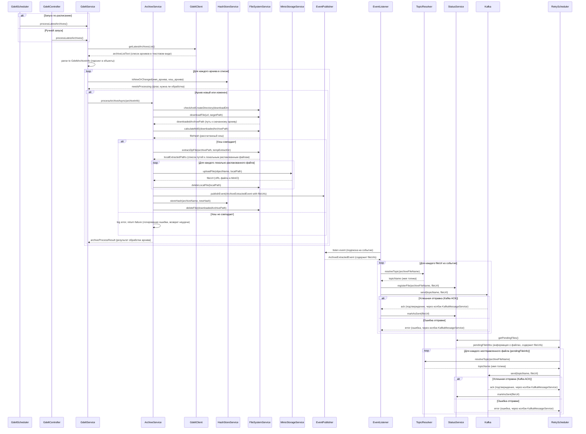

# Сервис сбора данных (em-collector)

Микросервис `em-collector` отвечает за автоматическое получение, обработку и передачу информации о файлах данных из внешнего источника. Он регулярно проверяет наличие новых или обновленных архивов данных, загружает их, распаковывает, **сохраняет в S3-совместимое хранилище MinIO** и отправляет **URL-адреса** к этим файлам в соответствующие топики Apache Kafka для дальнейшей обработки другими сервисами.

## Основной рабочий процесс

1.  **Планирование и запуск:**
    *   Процесс инициируется либо автоматически по расписанию (`GdeltScheduler`, по умолчанию каждую минуту), либо вручную через REST API эндпоинт `POST /api/v1/gdelt/process` (`GdeltController`).
    *   Оба способа запускают основной метод `GdeltService.processLatestArchives()`.

2.  **Получение списка архивов:**
    *   Сервис (`GdeltService`) использует Feign-клиент (`GdeltClient`) для запроса текстового файла `lastupdate-translation.txt` с официального ресурса GDELT. Этот файл содержит информацию о последних доступных архивах: размер, MD5-хеш и URL для каждого архива.
    *   Feign-клиент настроен с механизмом повторных попыток (`FeignClientConfig`) для обработки временных сетевых проблем.

3.  **Парсинг и проверка необходимости загрузки:**
    *   Полученный текстовый ответ парсится в список объектов `GdeltArchiveInfo`, каждый из которых представляет один архив.
    *   Для каждого архива из списка сервис обращается к `HashStoreService` (реализация `RedisHashStoreServiceImpl`), чтобы проверить, является ли архив новым или его содержимое изменилось. Проверка осуществляется путем сравнения текущего MD5-хеша (из `lastupdate-translation.txt`) с хешем, сохраненным в Redis для этого имени архива (ключ вида `gdelt:archive:hash:{archiveName}`).

4.  **Загрузка и обработка архивов (асинхронно):**
    *   Архивы, которые определены как новые или измененные, обрабатываются асинхронно (с использованием `Executor` на базе виртуальных потоков, настроенного в `AppConfig`).
    *   Для каждого такого архива (`ArchiveServiceImpl`):
        *   **Создание директории для загрузки:** Сервис проверяет и при необходимости создает директорию для загрузки (`gdelt.storage.download-dir`).
        *   **Загрузка архива:** Архив загружается по URL с помощью `FileSystemService.downloadFile()`.
        *   **Проверка целостности:** После загрузки `FileSystemService.calculateMd5()` вычисляет MD5-хеш скачанного файла. Этот хеш сравнивается с ожидаемым. Если они не совпадают, процесс для этого архива завершается с ошибкой.
        *   **Распаковка во временную директорию:** Если проверка прошла успешно, `FileSystemService.extractZipFile()` распаковывает содержимое ZIP-архива во *временную локальную директорию*. Этот метод включает защиту от уязвимости "Zip Slip".
        *   **Загрузка в MinIO:** Каждый извлеченный файл загружается в S3-совместимое хранилище MinIO с помощью `MinioStorageService`. Сервис возвращает URL для каждого загруженного файла.
        *   **Публикация события:** При успешной загрузке всех файлов из архива в MinIO, публикуется событие `ArchiveExtractedEvent`, содержащее информацию об исходном архиве (`GdeltArchiveInfo`) и список **URL-адресов** к загруженным в MinIO файлам (`List<String>`).
        *   **Обновление хеша:** Новый MD5-хеш успешно обработанного архива сохраняется в Redis через `HashStoreService.storeHash()`.
        *   **Очистка:** Загруженный ZIP-архив и *временные локальные распакованные файлы* удаляются после успешной обработки.

5.  **Обработка события распаковки (асинхронно):**
    *   `ArchiveExtractedEventListener` асинхронно обрабатывает событие `ArchiveExtractedEvent`.
    *   Для каждого **URL извлеченного файла** (`String`) из события:
        *   **Определение топика Kafka:** `GdeltTopicResolver` определяет целевой топик Kafka на основе имени исходного архива.
        *   **Регистрация статуса отправки:** `FileSendStatusService` (реализация `RedisFileSendStatusServiceImpl`) регистрирует информацию о файле (используя его URL) в Redis (например, ключ `gdelt:file:url:{fileUrl}`). Создается запись `ExtractedFileInfo` со статусом `isSent = false`. Эта запись имеет TTL.
        *   **Отправка в Kafka:** Слушатель использует `KafkaMessageService` для отправки сообщения в определенный топик. Сообщение содержит **URL файла** в MinIO.
        *   **Обновление статуса:** При получении подтверждения от Kafka об успешной отправке, `FileSendStatusService.markAsSent()` (вызываемый из `KafkaMessageService`) обновляет статус файла в Redis на `isSent = true` (используя URL файла).

6.  **Механизм повторной отправки в Kafka:**
    *   `FileSendRetryScheduler` запускается по расписанию (`gdelt.retry.interval`).
    *   Он запрашивает у `FileSendStatusService` список всех файлов (по их URL), у которых статус `isSent = false`.
    *   Для каждого такого файла (представленного его URL) планировщик определяет нужный топик Kafka и использует `KafkaMessageService` для повторной отправки **URL файла** в Kafka.
    *   `KafkaMessageService` автоматически обновляет статус файла на `isSent = true` через `FileSendStatusService` в случае успешной отправки.

## Диаграмма последовательности (клик на кнопку ⟷ развернет схему)

